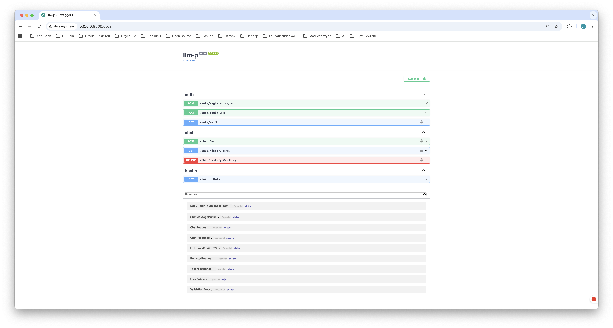
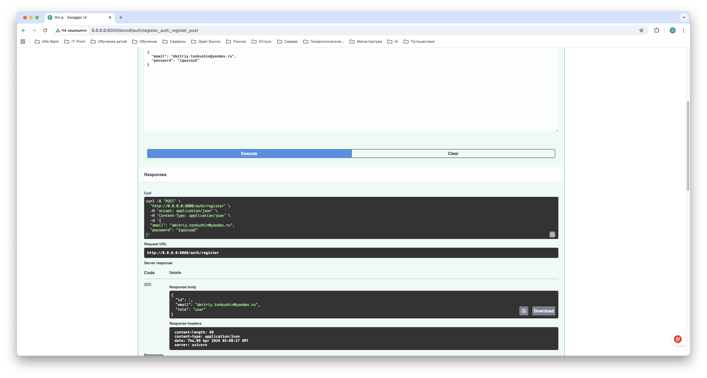
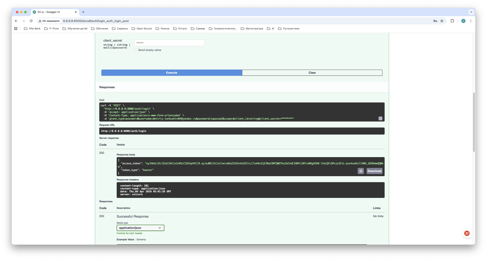
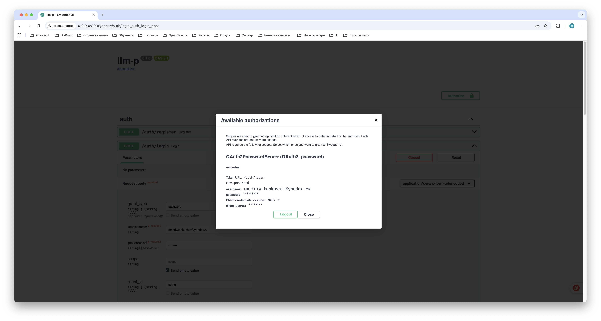
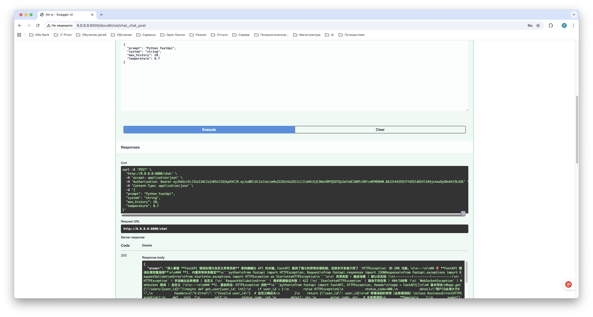
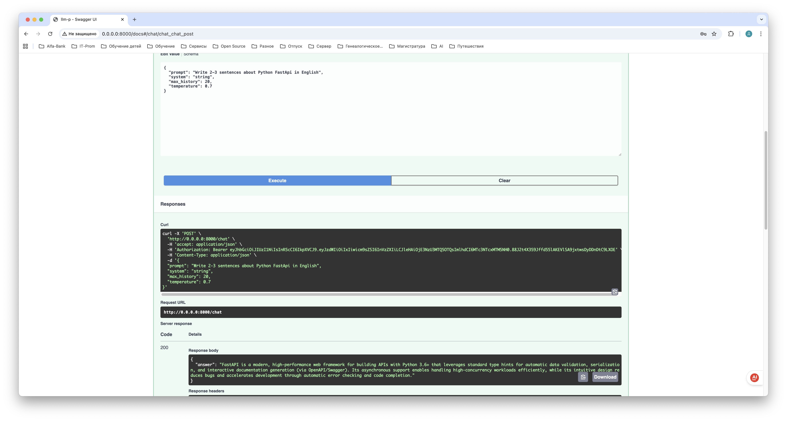
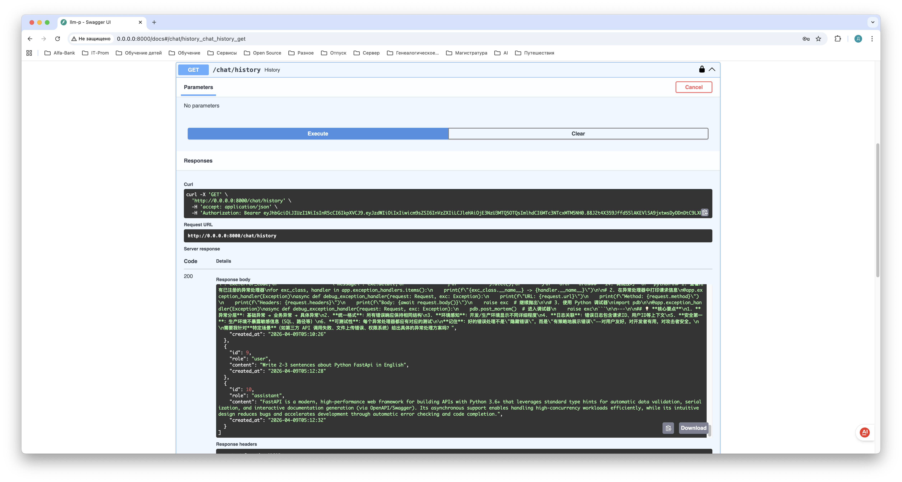
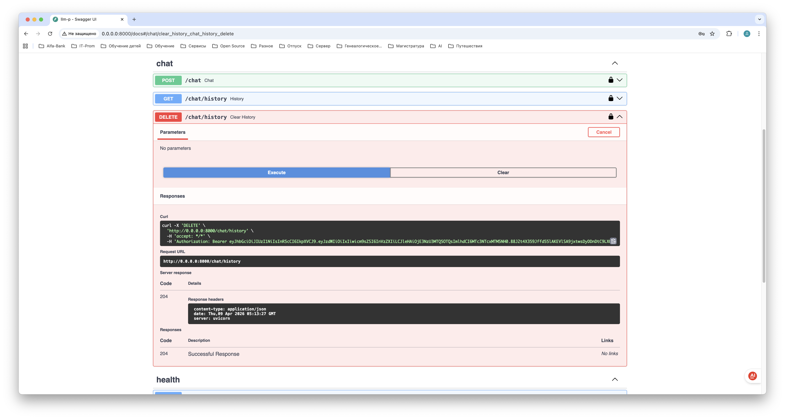
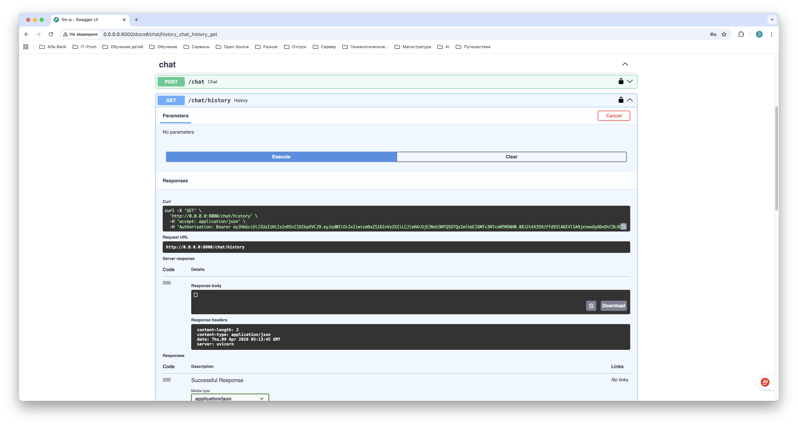

# secure-llm-api

Сервис на **FastAPI**: регистрация/логин с **JWT**, **SQLite**, прокси к LLM через **OpenRouter**. Слои: API → usecases → repositories → БД / внешний клиент.

## Требования

- Python **≥ 3.11**
- [uv](https://docs.astral.sh/uv/) (установка: `pip install uv`)

## Установка и зависимости

```bash
cd /path/to/secure-llm-api

# виртуальное окружение и зависимости проекта
uv venv
source .venv/bin/activate   # macOS / Linux
# Windows: .venv\Scripts\activate

uv sync
# тесты (опционально):
uv sync --group dev
```

Зависимости из `pyproject.toml` можно также поставить так (как в методичке):

```bash
uv pip install -r <(uv pip compile pyproject.toml)
```

## Настройка окружения

1. Скопируй пример и отредактируй `.env`:
  ```bash
   cp .env.example .env
  ```
2. В **OpenRouter** зарегистрируйся и возьми API-ключ.
3. В `.env` укажи ключ **без кавычек**:
  ```env
   OPENROUTER_API_KEY=sk-or-v1-...
  ```
4. Остальные переменные (JWT, путь к SQLite, модель) можно оставить как в `.env.example`, при необходимости поменяй `JWT_SECRET` в проде.

## Запуск

```bash
source .venv/bin/activate
uv run uvicorn app.main:app --reload --host 0.0.0.0 --port 8000
```

- Документация Swagger: [http://127.0.0.1:8000/docs](http://127.0.0.1:8000/docs)  
- Проверка живости: `GET /health`

## Проверка кода

```bash
uv run ruff check
uv run pytest tests/ -v
```

Ожидается: `All checks passed!` и успешные тесты.

## Скриншоты

Иллюстрации работы эндпоинтов: изображения встроены в README (поддерживаются GitHub, GitLab и предпросмотр Markdown в IDE). Исходные файлы лежат в каталоге `screenshots/`.

### Запуск Swagger UI (`GET /docs`)



### Регистрация — `POST /auth/register`



### Вход — `POST /auth/login` (ответ с JWT)



### Авторизация в Swagger — кнопка **Authorize**



### Чат — `POST /chat` (первый запрос)



### Чат — `POST /chat` (второй запрос, история в контексте)



### История — `GET /chat/history`



### Очистка истории — `DELETE /chat/history`



### История после очистки — `GET /chat/history`



## OpenRouter: ошибка 404 «No endpoints found»

Сообщение вроде `No endpoints found for stepfun/step-3.5-flash:free` приходит **от OpenRouter**: для этой комбинации модели и бесплатного суффикса `:free` сейчас **нет активного провайдера** (это не баг FastAPI).

Что сделать:

1. Открой [модели OpenRouter](https://openrouter.ai/models), отфильтруй **Free** и скопируй **точный Model ID** из карточки (например `google/gemma-2-9b-it:free` — пример, актуальный список только на сайте).
2. В `**.env`** выставь:
  ```env
   OPENROUTER_MODEL=<вставь_model_id_с_сайта>
  ```
3. Перезапусти uvicorn (настройки читаются при старте).

Если нужен именно StepFun без привязки к free-маршруту и на балансе есть кредиты — попробуй `**stepfun/step-3.5-flash**` (без `:free`). Для зачёта по методичке в отчёте можно указать, что в `.env` используется модель из задания, а при недоступности free-эндпоинта выбрана рабочая альтернатива с OpenRouter (уточни у преподавателя).

## Структура проекта (кратко)

- `app/main.py` — сборка приложения, lifespan, `/health`
- `app/core/` — настройки, security, ошибки
- `app/db/` — модели, сессия
- `app/repositories/` — доступ к данным
- `app/services/openrouter_client.py` — клиент OpenRouter
- `app/usecases/` — сценарии
- `app/api/` — роуты и DI
- `tests/` — pytest smoke-тесты

## Переменные окружения (напоминание)

См. `.env.example`: `APP_NAME`, `ENV`, JWT, `SQLITE_PATH`, ключ и URL OpenRouter, `OPENROUTER_MODEL` (по умолчанию как в задании; при 404 — см. раздел выше).